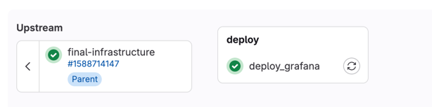

# Grafana on Nomad

This repository contains the configs for deploying Grafana on HashiCorp Nomad.

## Contents

- [Pre-requisites](#pre-requisites)
- [Usage](#usage)

## Pre-requisites

- Running hashicorp nomad cluster up and available on your network
- Configured Gitlab Repository with all needed variables
- Running hashicorp consul cluster up and available on your network

## Usage

This section contains step-by-step guide how to use this repository to deploy Grafana on HashiCorp Nomad.

### Before deploy initialization

Before deploying Grafana on Nomad you need to configure all environment.

*This guide is based on the Nomad and Consul from this repository.*

```bash
make configure-volumes
```

This will configure required volumes for Grafana in Nomad client.

Now, you need to configure the Grafana environment variables.

```dotenv
NOMAD_VAR_grafana_github_client_id = # Github client id
NOMAD_VAR_grafana_github_client_secret = # Github client secret
NOMAD_VAR_grafana_gitlab_client_id = # Gitlab client id
NOMAD_VAR_grafana_gitlab_client_secret = # Gitlab client secret
NOMAD_VAR_grafana_google_client_id = # Google client id
NOMAD_VAR_grafana_google_client_secret = # Google client secret
TF_VAR_NOMAD_HOST = http://nomad.service.devops.org:4646 # Nomad host
```

If you will ask why nomad host is called TF_VAR_NOMAD_HOST, it's because we already will have this variable in the
environment.
This variable will be set when gitlab runners will be deployed.

### Deploy

To deploy Grafana on Nomad you need to push to repo the following .gitlab-ci.yml

```yaml
stages:
  - deploy

deploy_grafana:
  stage: deploy
  image:
    name: hashicorp/nomad:latest
    entrypoint:
      - /usr/bin/env
      - "PATH=/usr/local/sbin:/usr/local/bin:/usr/sbin:/usr/bin:/sbin:/bin"
  script:
    - echo "Deploying Grafana..."
    - export NOMAD_ADDR=$TF_VAR_NOMAD_HOST
    - nomad job run grafana/grafana.nomad
    - nomad job status grafana
```

And this will setup Grafana on Nomad.

#### Fig 1.0 - CI pipeline


#### Fig 1.1 - Grafana on Nomad

