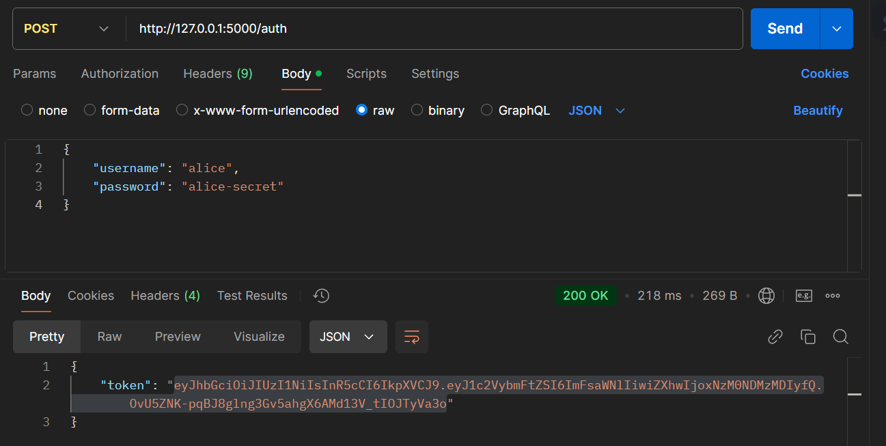
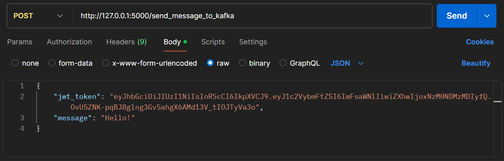

# Apache Kafka

This repository contains ansible playbook for Kafka configuration. It will install kafka and make configurations,
systemd unit files.

## Pre-requisites

- Ansible installed
- Linux based system in order to create systemd unit files

## Usage

To configure

```bash
ansible-playbook -i inventory kafka_sasl.yml
```

To create a topic under **Kafka** user:

```bash
/opt/kafka/bin/kafka-topics.sh --create --topic test --bootstrap-server localhost:9092 --replication-factor 1 --partitions 1 --command-config client-sasl.properties
```

Check that everything is working using these commands:

```bash
systemctl status zookeeper.service
systemctl status kafka.service
```

Check logs using these commands:

```bash
journalctl -u kafka.service -f
journalctl -u zookeeper.service -f
```

## Configuration

Configuration files located on this directory

If you have any errors with running of kafka.service, you can solve by giving permissions to configuration files of kafka
Verify the ownership of the directory and files:

```bash
ls -l /opt/kafka/logs/
```
2. Delete the Logs as root
Use sudo to remove the directory and its contents:

```bash
sudo rm -rf /opt/kafka/logs/*
```
If the files still cannot be deleted, ensure that no Kafka process is actively locking them:

```bash
sudo systemctl stop kafka.service
sudo lsof | grep "/opt/kafka/logs"
```
Kill any lingering Kafka-related processes if necessary:

```bash
sudo kill -9 <PID>
```
Then reattempt the deletion.

3. Change Ownership (if Needed)
If /opt/kafka/logs or its contents have incorrect ownership, reset it:

```bash
sudo chown -R kafka:kafka /opt/kafka/logs/
```

4. Restart Kafka
Once the logs are cleared, restart Kafka:

```bash
sudo systemctl restart kafka.service
```
5. Reinitialize Logs (if Cleared)
If you've completely cleared the logs directory, Kafka will regenerate the necessary files during startup. Confirm that the meta.properties file is recreated and matches the expected cluster.id:
```bash
cat /opt/kafka/logs/meta.properties
```
6. Prevent Future Permission Issues
Ensure that Kafka has consistent access to the log.dirs directory:

```bash
sudo chown -R kafka:kafka /opt/kafka/
sudo chmod -R 755 /opt/kafka/
```

## Temporary database

Create a database and user for the authorization API:
```bash
sudo -u postgres psql   
```
Inside the PostgreSQL shell:
```bash
CREATE DATABASE auth_db;
CREATE USER auth_user WITH PASSWORD 'auth_password';
GRANT ALL PRIVILEGES ON DATABASE auth_db TO auth_user;
```

Create the secrets table to store usernames and secrets:
```bash
\c auth_db

CREATE TABLE secrets (
    id SERIAL PRIMARY KEY,
    username VARCHAR(50) UNIQUE NOT NULL,
    secret VARCHAR(255) NOT NULL
);
INSERT INTO secrets (username, secret) VALUES ('admin', 'admin-secret'), ('alice', 'alice-secret')
```
Grant All Permissions:
```bash
GRANT ALL PRIVILEGES ON TABLE secrets TO auth_user;

ALTER TABLE secrets OWNER TO auth_user;

GRANT USAGE ON SCHEMA public TO auth_user;
```

## Working with API
In the root of directory "api" create env, and install all libraries.

```bash
python3 -m venv env
source env/bin/activate
pip install -r requirements.txt
```
Run app.py
```bash 
uvicorn app:app --host 0.0.0.0 --port 5000
```
Sending requests




To see message:
```bash
 /opt/kafka/bin/kafka-console-consumer.sh --topic test --bootstrap-server localhost:9092
--from-beginning   --consumer.config /opt/kafka/config/client-sasl.properties
```
